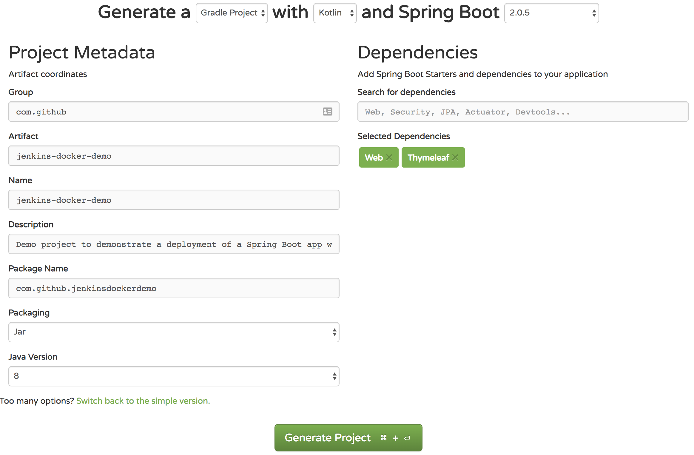
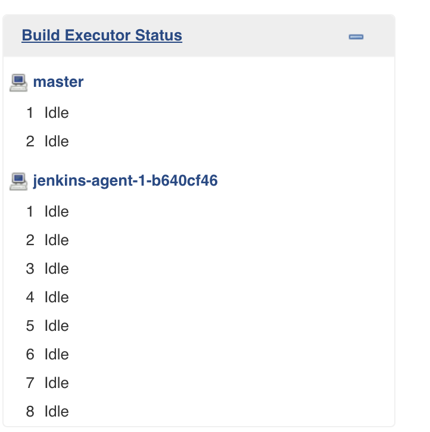
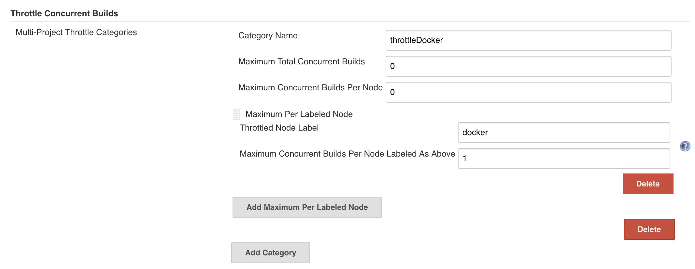

Setting up Jenkins with Blue Ocean to work with Docker took quite some time, while in reality it doesn't have to. I found an awesome video on YouTube by [Boxboat Technologies](https://youtu.be/GkGXAPj8wSI) that helped me out for the initial setup. 
In this post I'll use Jenkins Blue Ocean to create a Docker container with a simple Spring Boot app, run some tests and deploy the app to a server.

This will take a couple of steps: 
1. Create a simple Spring Boot app
    1. Use start.spring.io to generate the bootstrap app
    1. Create a very simple page
    1. Create a very simple unit test just to prove we can run tests
    1. Push the code to Github
1. Prepare the server(s) with Jenkins Blue Ocean
    1. Create a Jenkins master
    1. Create a Jenkins build agent
1. Prepare a server to host our app
1. Setup Jenkins to deploy our app
1. Deploy the app and enjoy the result

# First step: Create a simple Spring Boot app
Since there are a lot of very good tutorials on the web describing the creation of Spring Boot applications I won't spend too much time on that here.

## Generate Spring boot app
First we'll go to [start.spring.io](https://start.spring.io/) and generate a bootstrap project. Here's my setup:

Download the project, unpack the zip file and open the project in your favorite IDE or text editor. I'll use IntelliJ.
 
As I said, this will be a very simple Spring Boot app, and I will use Kotlin and Gradle. I personally prefer to use Kotlin Gradle DSL, but since this is mainly about deployment, I'll just stick to the defaults.

I used a simple [Bootstrap](http://getbootstrap.com/) template named [Freelancer](https://startbootstrap.com/template-overviews/freelancer/) and used [Thymeleaf](https://www.thymeleaf.org/) to serve the page on Spring Boot. 

The project I use for this demo can be found on [Github](https://github.com/johanvergeer/jenkins-docker-demo)

# Setup Jenkins with Blue Ocean
I'll use [DigitalOcean](https://m.do.co/c/bb3d4e750ffb) for hosting. As a software developer I found this very easy to setup and maintain servers.

## Setup Jenkins Master
First step is to install a Jenkins Master. We'll use Docker to run Jenkins on the server.




Run the Jenkins container and tail the logs



Open the Jenkins web ui at `http://yourhostname:8080` and install the following plugins

> The Jenkins admin password was shown when Jenkins was started in your console

- [Blue Ocean](https://jenkins.io/projects/blueocean/) is just for the Blue Ocean UI
- [AnsiColor](https://github.com/jenkinsci/ansicolor-plugin)
- [Self-Organizing Swarm Plug-in Modules](https://wiki.jenkins.io/display/JENKINS/Swarm+Plugin) to let the Jenkins agent connect to the Jenkins master
- [Throttle Concurrent Builds Plug-in](https://github.com/jenkinsci/throttle-concurrent-builds-plugin) to restrict the amount of jobs that will run in parallel on our build agent

After installing confirm the plugins have moved from the "Available" to the "Installed" page. This will also have installed other dependencies that are required by the plugins.

## Setup a Jenkins Agent
Once we have a Jenkins Master, we can setup a Jenkins agent we'll use to run our builds on. Here we'll also use Docker so let's install it first




### Jenkins Swarm module
The Jenkins Swarm module comes with a cli agent, which connects the Jenkins agent to the Jenkins master. 
First we'll need Java 8 to let us run the Jenkins swarm cli agent, which is a Java client on the Jenkins agent


Next download the Jenkins Swarm client


Create a shell script that executes the Jenkins Swarm client


#### Confirm the Swarm client is working

Now when you run the script we just created you should see something like the following output which confirms we can connect to the Jenkins master


And in the Jenkins UI you should see something like this in the botton left corner

#### Create a service to start `swarm.sh`

Edit the file `/etc/systemd/system/jenkins.service` so that it contains the following:


Start the Jenkins service:


Now each time the agent starts it will  connect to Jenkins master and is ready to receive build commands. 

# Configure throttle concurrent builds plugin

First go to *Manage Jenkins > Configure system > Throttle Concurrent Builds*

- Notice the *Throttled Name Label* value `docker`. This is the same value we used in *swarm.sh* on the agent for the `-label` argument. 
- A value to keep in mind for now is *Category Name* with value `throttleDocker`, which we'll use in the **Jenkinsfile** later.
- *Maximum Concurrent Builds Per Node Labeled As Above* indicates the maximum number of simultanious builds on the agent.

# Blue Ocean
In the Jenkins dashboard select *Open Blue Ocean*, which will open the Blue Ocean UI. Since we don't have a pipeline configured yet we can start by selecting a git repository. This is pretty straigt forward, so I won't go into detail. 

In my case there is no Jenkinsfile at the moment, so Blue Ocean will prompt me to create one. 

Download docker-compose and vegeta binaries to `/usr/local`



# Install Sonarqube
To run our static code analysis we'll use Sonarqube. We could go the long way and install everything manually, or we can choose the short way and use Docker. I prefer the short way. 
From Docker Hub:


$ docker run -d --name sonarqube -p 9000:9000 -p 9092:9092 sonarqube
